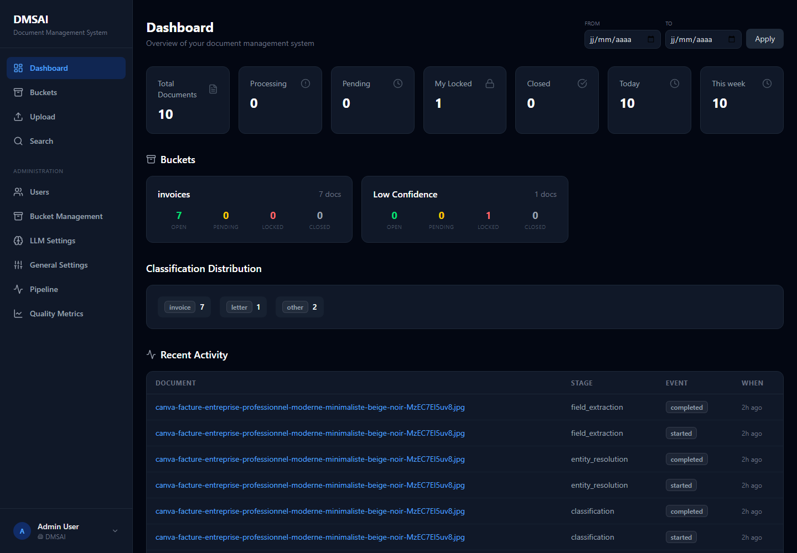
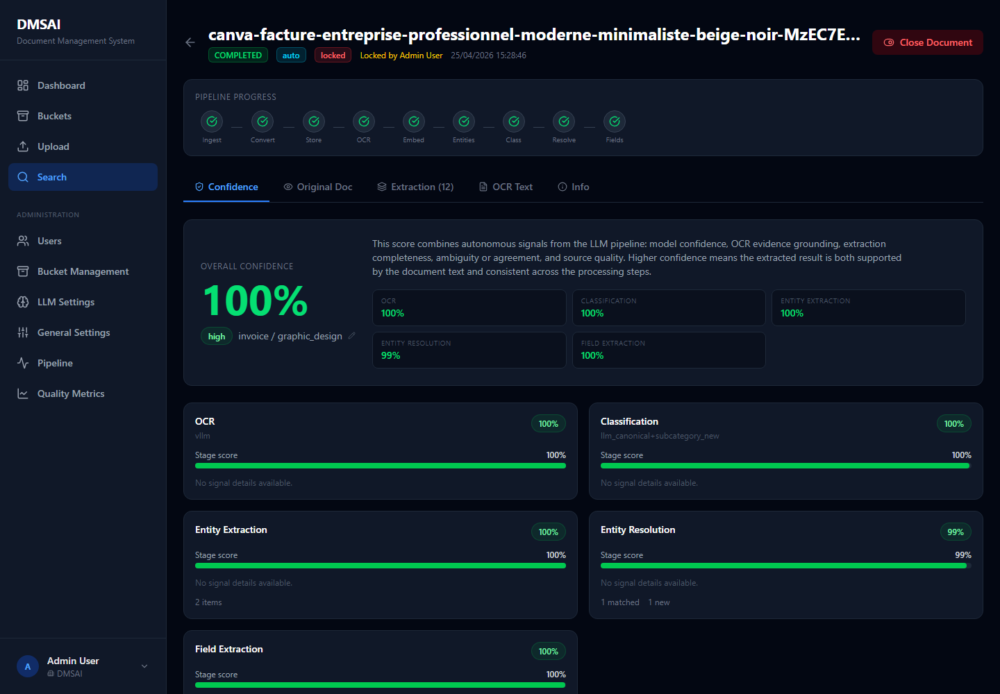
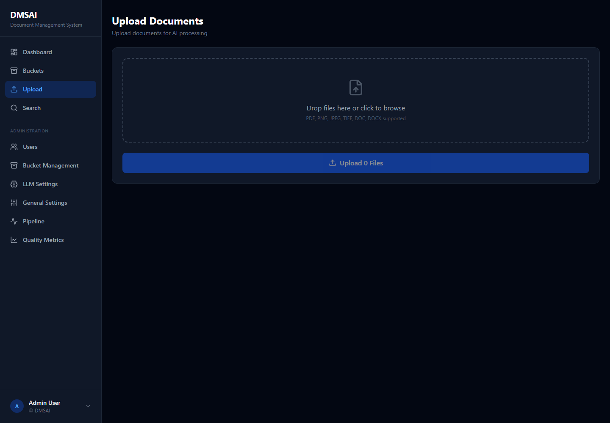

# DMSAI

DMSAI is a self-hosted, AI-assisted document management system. It ingests documents, converts them to a normalized PDF representation, stores them, extracts OCR text with a vision LLM, builds dense embeddings, classifies documents with canonical category labels, resolves entities, and extracts structured fields.

The backend is a set of local FastAPI microservices built on [DecentraFlow](README_decentraflow.md). The frontend is a React + Vite application served separately from the API gateway.

> Start this repository as private. Review secrets, license, and deployment settings before making it public.

## Screenshots

| Dashboard | Documents |
| --- | --- |
|  |  |

| Document detail | Upload |
| --- | --- |
|  |  |

| Buckets | LLM settings |
| --- | --- |
|  |  |

## Features

- Upload documents through the web UI or authenticated API.
- Convert supported images/documents into pipeline-ready PDFs.
- Extract OCR text with the configured vision LLM.
- Generate dense embeddings through Ollama or LiteLLM.
- Classify documents with an LLM and canonical category/subcategory labels.
- Extract and resolve entities across documents.
- Extract structured fields and confidence details.
- Route documents into buckets using classification, field, entity, confidence, or vision rules.
- Configure prompts, thresholds, providers, LDAP, email, buckets, and confidence settings from the admin UI.
- Run locally with a single CLI command and optional Grafana/Loki monitoring.

## Architecture

```text
Frontend 5173
    |
    v
API Gateway 8080
    |
    v
ingestion:8010 -> conversion:8011 -> storage:8012 -> ocr:8013
                                                       |
                                                       v
embedding:8014 -> entity_extraction:8015 -> classification:8016
                                                       |
                                                       v
entity_resolution:8017 -> field_extraction:8018
```

The node ports are intended for local/internal service-to-service traffic. External applications should use the API gateway on port `8080`, not the individual node ports.

## Services

| Service | Port | Path | Purpose |
| --- | ---: | --- | --- |
| Ingestion | 8010 | `nodes/ingestion_node` | Upload API and directory watcher |
| Conversion | 8011 | `nodes/conversion_node` | Convert files into pipeline-ready PDFs |
| Storage | 8012 | `nodes/storage_node` | Persist files and document metadata |
| OCR | 8013 | `nodes/ocr_node` | Extract text with a vision LLM |
| Embedding | 8014 | `nodes/embedding_node` | Build dense LLM-provider embeddings |
| Entity extraction | 8015 | `nodes/entity_extraction_node` | Extract named entities |
| Classification | 8016 | `nodes/classification_node` | Classify with canonical category labels |
| Entity resolution | 8017 | `nodes/entity_resolution_node` | Normalize and merge entities |
| Field extraction | 8018 | `nodes/field_extraction_node` | Extract structured fields |
| API gateway | 8080 | `api_gateway` | Authenticated app and integration API |
| LiteLLM | 4000 | `litellm_config.yaml` | Optional LLM proxy |
| Frontend | 5173 | `frontend` | React user interface |

## Requirements

- Python 3.11+
- Node.js 18+
- Ollama, LiteLLM, or another compatible LLM provider
- Docker, optional, for Loki/Promtail/Grafana monitoring

## Quick Start

Create a local environment file:

```powershell
Copy-Item .env.example .env
```

Edit `.env` and set strong local values for:

- `DMSAI_JWT_SECRET`
- `DMSAI_INTERNAL_API_KEY`
- `GEMINI_API_KEY`, if you use LiteLLM with Gemini

Install Python packages:

```powershell
pip install -e .\core_framework
pip install -e .\shared
pip install -r .\api_gateway\requirements.txt

foreach ($node in Get-ChildItem .\nodes -Directory) {
  if (Test-Path "$($node.FullName)\requirements.txt") {
    pip install -r "$($node.FullName)\requirements.txt"
  }
}
```

Install frontend packages:

```powershell
cd .\frontend
npm install
cd ..
```

Start the stack:

```powershell
python .\dmsai.py start
```

Open:

- Frontend: `http://localhost:5173`
- API gateway: `http://localhost:8080`
- Pipeline health: `http://localhost:8080/api/pipeline/health`

Useful CLI commands:

```powershell
python .\dmsai.py status
python .\dmsai.py logs ocr
python .\dmsai.py restart
python .\dmsai.py stop
python .\dmsai.py clean-db
```

`clean-db` deletes local runtime data. Do not use it against production data.

## Configuration

Runtime configuration is stored in the database through `SystemConfig` and is editable from the admin UI.

Important files:

- `.env.example`: safe environment variable template.
- `.env`: local secrets and machine-specific values. This file is ignored by git.
- `api_gateway/config/auth.yaml`: default auth, registration, email, and LDAP settings.
- `litellm_config.yaml`: LiteLLM model routing. API keys are read from environment variables.
- `nodes/*/config/routing.yaml`: pipeline routing between nodes.
- `nodes/*/config/local_config.yaml`: node-specific local options.
- `docker-compose.yml`: optional monitoring stack only.

Security-sensitive settings:

- `DMSAI_JWT_SECRET`: signs API tokens.
- `DMSAI_INTERNAL_API_KEY`: protects internal gateway callbacks such as bucket auto-assignment.
- `GEMINI_API_KEY` / provider keys: used by LiteLLM or LLM providers.
- SMTP and LDAP passwords: keep out of committed config.

## External API

External applications should authenticate through the API gateway and send a bearer token.

Login:

```powershell
$login = Invoke-RestMethod `
  -Method Post `
  -Uri "http://localhost:8080/api/auth/login" `
  -ContentType "application/json" `
  -Body '{"email":"admin@dmsai.com","password":"admin123"}'

$headers = @{ Authorization = "Bearer $($login.access_token)" }
```

Upload a document:

```powershell
curl.exe -X POST "http://localhost:8080/api/upload" `
  -H "Authorization: Bearer $($login.access_token)" `
  -F "file=@invoice.pdf" `
  -F "priority=0" `
  -F "mode=auto"
```

List and search documents:

```powershell
Invoke-RestMethod "http://localhost:8080/api/documents?page=1&page_size=20" -Headers $headers
Invoke-RestMethod "http://localhost:8080/api/search?q=invoice" -Headers $headers
```

Read extracted data:

```powershell
Invoke-RestMethod "http://localhost:8080/api/documents/<document_id>" -Headers $headers
Invoke-RestMethod "http://localhost:8080/api/documents/<document_id>/fields" -Headers $headers
Invoke-RestMethod "http://localhost:8080/api/documents/<document_id>/entities" -Headers $headers
```

Download the normalized PDF:

```powershell
curl.exe -L "http://localhost:8080/api/documents/<document_id>/pdf" `
  -H "Authorization: Bearer $($login.access_token)" `
  -o document.pdf
```

The document detail response includes `ocr_text`, classification labels, confidence details, and `pdf_url`. It does not expose the server filesystem storage path.

## Monitoring

The Docker Compose stack runs logging infrastructure only. It does not run the DMSAI application services.

```powershell
$env:GRAFANA_ADMIN_PASSWORD = "change-this-password"
docker compose up -d
```

Monitoring URLs:

- Grafana: `http://localhost:3000`
- Loki API: `http://localhost:3100`

## Development

Run backend compile checks:

```powershell
python -m compileall api_gateway nodes shared
```

Build the frontend:

```powershell
cd .\frontend
npm run build
cd ..
```

Run tests:

```powershell
pytest
```

## Project Layout

```text
DMSAI/
|-- api_gateway/       FastAPI gateway and frontend-facing routers
|-- core_framework/    DecentraFlow framework package
|-- frontend/          React, TypeScript, Vite, Tailwind UI
|-- nodes/             Pipeline microservices
|-- shared/            Shared SQLModel models, DB, LLM, confidence helpers
|-- docs/images/       README screenshots
|-- monitoring/        Loki, Promtail, and Grafana provisioning
|-- data/              Local runtime data, ignored by git
|-- logs/              Local service logs, ignored by git
|-- dmsai.py           Local stack CLI
`-- litellm_config.yaml
```

## Publish Checklist

Before making the repository public:

- Confirm `.env`, `data/`, logs, SQLite databases, and local model artifacts are not tracked.
- Rotate any key that was ever committed or shared.
- Set a real `DMSAI_JWT_SECRET` and `DMSAI_INTERNAL_API_KEY`.
- Keep node ports `8010-8018` private behind the API gateway.
- Decide and add a `LICENSE` file.
- Review `api_gateway/config/auth.yaml` for registration, LDAP, and email defaults.

## License

No license has been selected yet. Add a license before publishing the repository publicly.
