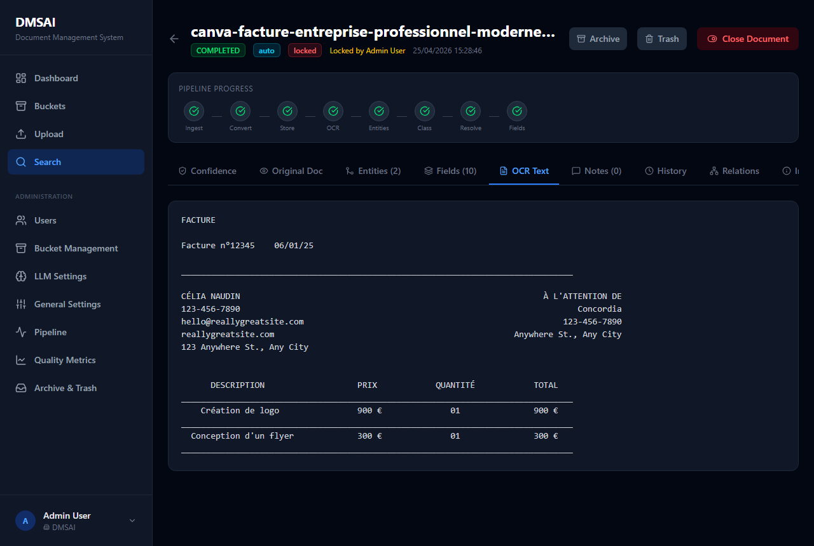
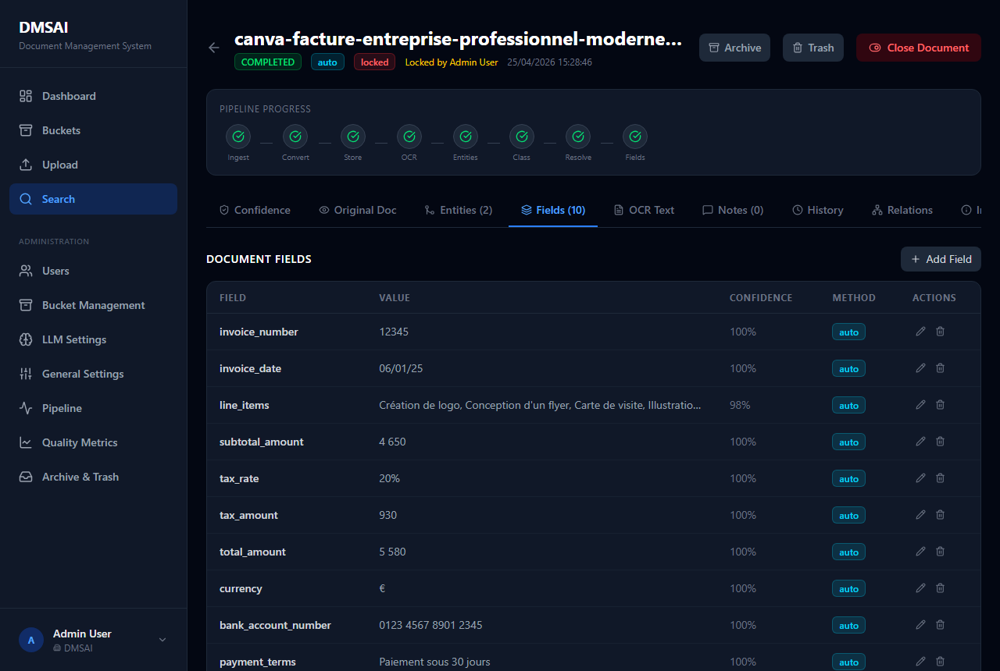
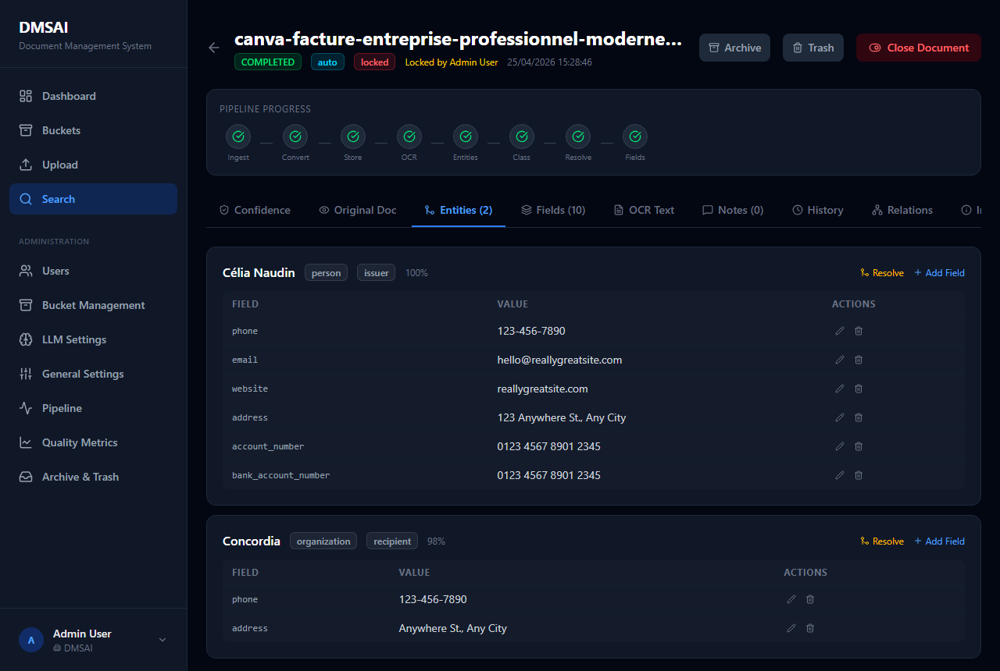
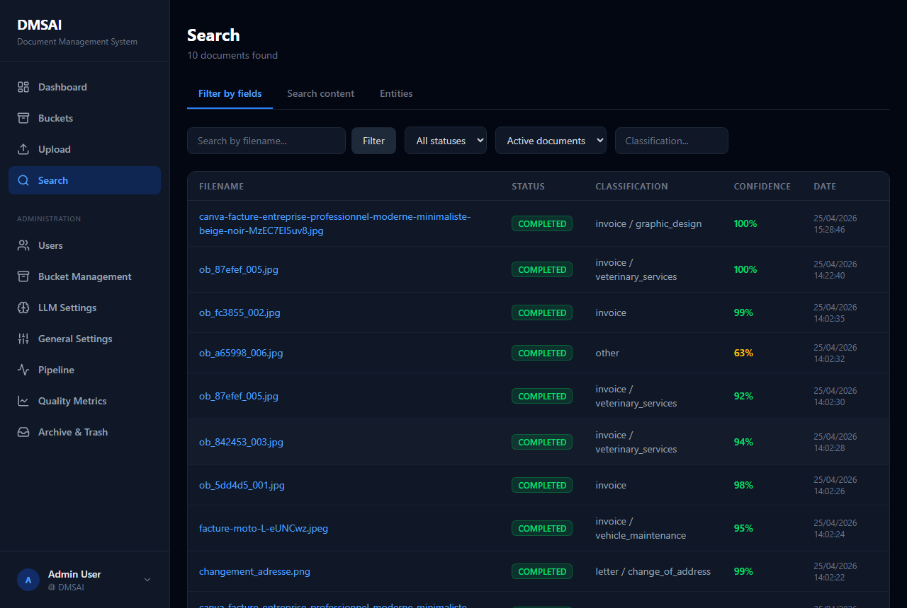
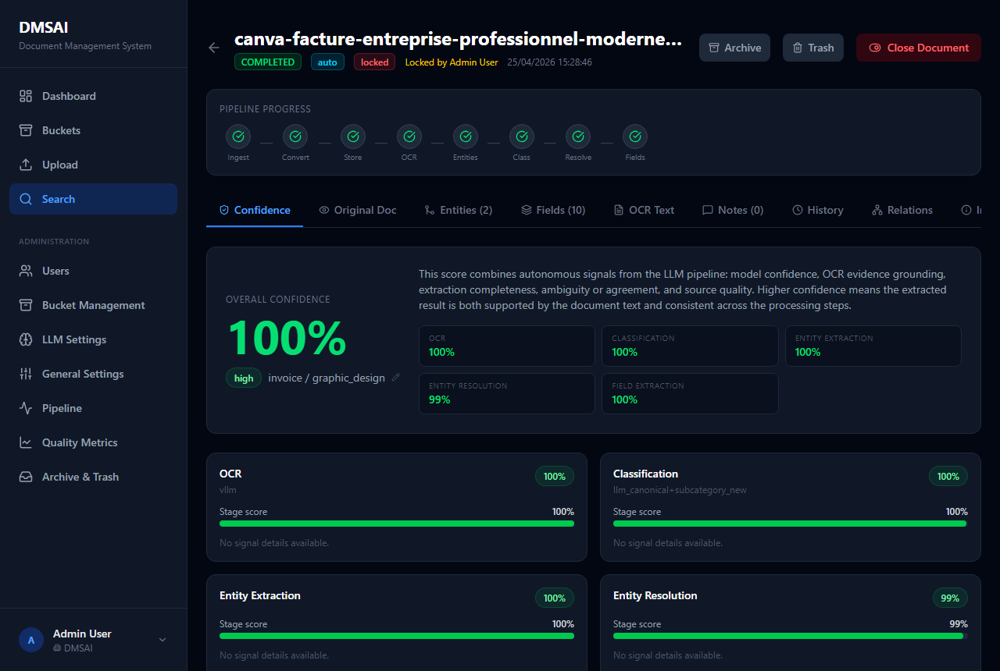
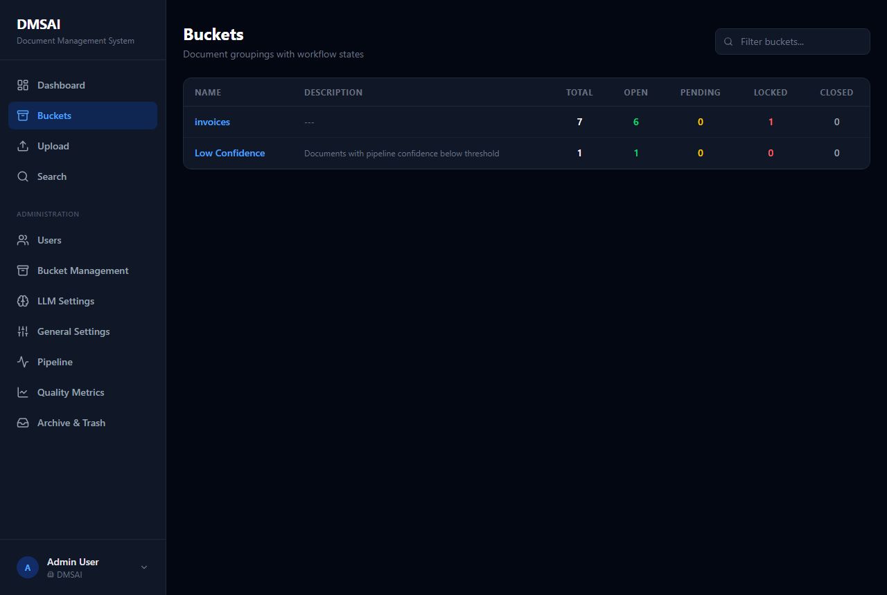
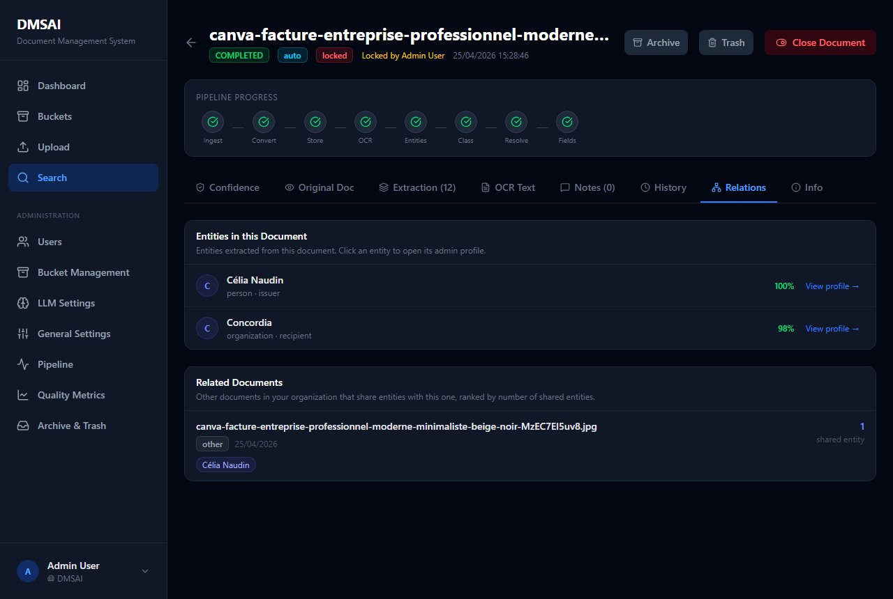
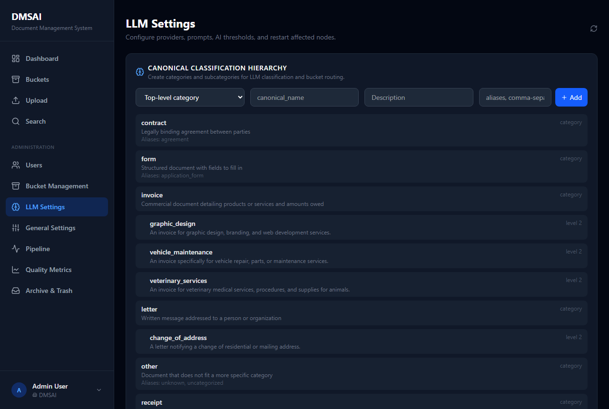
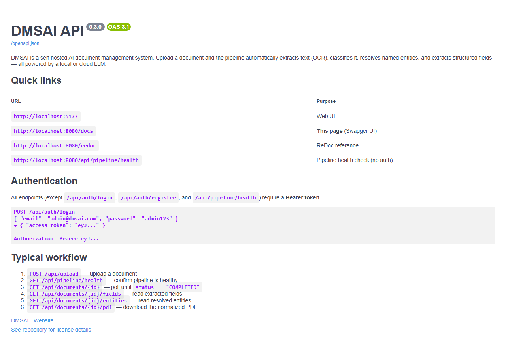

# DMSAI — AI Document Management System

Drop a document in. Get back OCR text, a document type, every named entity, and all structured fields — fully automated, fully local, no training required.

DMSAI is a **self-hosted**, **LLM-powered** document intelligence platform built on a chain of independent FastAPI microservices. The only external dependency is an LLM — run it locally with Ollama or point it at any cloud provider.

[](#feature-showcase)
[](http://localhost:8080/docs)
[](#architecture)

---

## Feature Showcase

The sections below describe each feature, where to find it in the UI, and the relevant API endpoint.

---

### Vision OCR & Text Extraction

<table><tr>
<td valign="top" width="55%">

A **vision LLM** reads every page — not just selectable text, but also scanned images, handwriting, stamps, and dense tables that traditional OCR tools struggle with.

- Works on PDF, JPG, PNG, TIFF and more
- Full OCR text stored and indexed for full-text search
- Confidence score visible on the document detail page → **Info** tab
- Raw text shown in the **OCR** tab alongside the normalized PDF

*Pipeline stage: OCR node* → `GET /api/documents/{id}` (field `ocr_text`)

</td>
<td valign="top" align="center">



</td>
</tr></table>

---

### Structured Field Extraction

<table><tr>
<td valign="top" width="55%">

After OCR, the **Field Extraction** node asks the LLM to fill in every field in your canonical field catalogue, using the raw OCR text as evidence.

- Fields are mapped to **canonical names** (e.g. `invoice_total`) — consistent across all document layouts
- Every field carries a confidence score and extraction method
- Editable from the **Fields** tab on the document detail page
- Create, update, or delete fields manually at any time

*Pipeline stage: Field Extraction node* → `GET /api/documents/{id}/fields`

</td>
<td valign="top" align="center">



</td>
</tr></table>

---

### Entity Extraction & Resolution

<table><tr>
<td valign="top" width="55%">

Named entities (people, companies, addresses, tax IDs…) are extracted and automatically **canonicalized** — the same entity mentioned differently across documents is linked to a single canonical record.

- The **Entities** tab lists every entity with type, role, confidence, and all its extracted fields
- Each entity can be manually resolved (merged) with the **Resolve** button
- Custom key/value fields can be added to any entity with **Add Field**
- Cross-document merging: the **Entity Resolution** node uses an **LLM-first** approach to detect near-duplicates

*Pipeline stages: Entity Extraction → Entity Resolution* → `GET /api/documents/{id}/entities`

</td>
<td valign="top" align="center">



</td>
</tr></table>

---

### Document Classification

<table><tr>
<td valign="top" width="55%">

The **Classification** node assigns a **canonical category and subcategory** to each document (e.g. `invoice / purchase`, `contract / employment`, `letter / internal`).

- Canonical classes are managed from **Admin → Document Classes** — new documents are automatically mapped to the nearest class
- Classification label and confidence are shown on document cards and the detail page
- Labels are used as filters in bucket rules and in the document list

*Pipeline stage: Classification node* → `GET /api/documents/{id}` (fields `classification_label`, `classification_confidence`)

</td>
<td valign="top" align="center">



</td>
</tr></table>

---

### Confidence Scoring

<table><tr>
<td valign="top" width="55%">

Every pipeline stage emits a **confidence score**. The final document confidence is a composite signal visible on every card and on the document detail page → **Confidence** tab.

- Per-stage signals: OCR quality, entity confidence, classification confidence, field extraction
- Expandable per-signal breakdown with method details
- Bucket rules can filter on confidence thresholds (e.g. only route documents with `confidence > 0.85`)

</td>
<td valign="top" align="center">



</td>
</tr></table>

---

### Smart Buckets & Document Routing

<table><tr>
<td valign="top" width="55%">

**Buckets** are rule-based document collections. After classification, each document is automatically matched against all bucket rules and placed into every matching bucket.

Rule conditions match on:
- Classification label or subcategory
- Extracted field values
- Named entity presence
- Confidence thresholds
- OCR text content (contains / regex)

Each bucket has its own **workflow states** (e.g. *to review*, *approved*, *rejected*) and optional per-user access permissions. Documents can also be **manually added** from the **Info** tab, overriding the automatic routing.

`GET /api/buckets` · `GET /api/buckets/{id}/documents`

</td>
<td valign="top" align="center">



</td>
</tr></table>

---

### Full-text Search & Document Relations

<table><tr>
<td valign="top" width="55%">

**Full-text search** (`/api/search`) runs across OCR text, classification labels, field values, and entity names in a single query — from the search bar at the top of the Documents page.

**Document relations** (the Relations tab on the detail page): shows all other documents that share at least one entity with the current document, ranked by the number of shared entities. Useful for tracing all invoices from the same company, contracts signed by the same person, etc.

</td>
<td valign="top" align="center">



</td>
</tr></table>

---

### Configurable LLM Prompts & Auto Ingestion

<table><tr>
<td valign="top" width="55%">

Every LLM prompt, threshold, and provider setting is editable from **Admin → LLM Settings** — no restarts, no config files.

- Switch between Ollama (local) and LiteLLM/Gemini (cloud) live
- Edit OCR, classification, entity extraction, entity resolution, and field extraction prompts
- Adjust confidence thresholds per stage
- Restart individual pipeline nodes after changes

Documents also enter the pipeline **automatically — no UI required**:

| Source | How |
|---|---|
| **Directory watch** | Polls `./data/inbox/` for new files |
| **Email / IMAP** | Polls a mailbox for PDF/image attachments |

Both are configured live from **Admin → General Settings → Ingestion**.

</td>
<td valign="top" align="center">



</td>
</tr></table>

---

### REST API & Swagger Docs

<table><tr>
<td valign="top" width="55%">

The full REST API is documented interactively at **http://localhost:8080/docs**.

- All endpoints grouped by resource (auth, documents, buckets, admin…)
- Try any endpoint directly from the browser
- ReDoc clean reference at `/redoc`
- Token auth, pagination, filters all documented

See the full reference: [docs/api.md](docs/api.md)

</td>
<td valign="top" align="center">



</td>
</tr></table>

---

### Auth, Roles & Monitoring

| Feature | Detail |
|---|---|
| **Authentication** | Local email/password, LDAP, and email-verification flows |
| **Roles** | `admin` · `manager` · `user` — controls who can create buckets, merge entities, edit config |
| **LDAP** | Configured from `api_gateway/config/auth.yaml` or live from Admin → General Settings |
| **Monitoring** | Grafana + Loki via `docker compose --profile monitoring up -d` |

---

### Other Features

- **Threaded notes** on every document — Markdown, reply, edit, delete
- **Document history** — full audit log of every field change, classification event, and lifecycle transition (History tab)
- **Version snapshots** — auto-saved on archive/trash; browse and compare full past document states
- **Archive & Trash** — soft-delete workflow before permanent deletion; storage compaction for archived PDFs
- **Pipeline monitoring** — real-time health of every processing node (status, queue depth, last heartbeat); restart any node individually from the UI
- **Entity merging** — manually resolve near-duplicate entities with the **Resolve** button on the Entities tab
- **Entity custom fields** — attach key/value metadata to any canonical entity, editable per-document
- **Bucket workflow states** — `open → to review → approved → rejected` with document locking per bucket
- **Per-user bucket permissions** — control which users can view or act on a given bucket
- **Dashboard** — processing statistics, pipeline status overview, and recent activity feed
- **Account lockout** — configurable failed-login limit and lockout duration (Admin → General Settings)
- **Email verification** — optional confirmation flow on self-registration
- **Multi-tenant organizations** — only admins can create organizations and manage user roles
- **Quality metrics** — per-stage accuracy tracking in Admin → Quality Metrics
- **Grafana + Loki monitoring** — structured logs from all nodes, queryable in Grafana (`docker compose --profile monitoring up -d`)
- **CLI management** — `python dmsai.py start | stop | restart | status | logs | clean-db`

---

## Quick Start

Two paths, same result — the app at **http://localhost:5173**.

### Docker (any OS — recommended)

> Requires [Docker Desktop](https://www.docker.com/products/docker-desktop/) + Ollama running locally (or a cloud key).

```bash
git clone https://github.com/americium-241/DMSAI.git && cd DMSAI
cp .env.example .env        # Ollama-ready defaults; secrets auto-generated on first start
docker compose up -d
```

Open **http://localhost:5173** · login `admin@dmsai.com` / `admin123`

→ Full Docker guide: [docs/install-docker.md](docs/install-docker.md)

---

### Native — Python (cross-platform, any OS)

> Requires Python 3.11+, Node.js 18+, Ollama.

```bash
git clone https://github.com/americium-241/DMSAI.git && cd DMSAI
python scripts/install.py      # install all dependencies
python dmsai.py start          # auto-creates .env, generates secrets, starts everything
```

Open **http://localhost:5173** · login `admin@dmsai.com` / `admin123`

Platform-specific guides: [Windows](docs/install-windows.md) · [Linux / macOS](docs/install-linux-macos.md)

#### CLI reference

```bash
python dmsai.py setup       # first-time setup (also auto-runs on first start)
python dmsai.py start       # start all services
python dmsai.py stop        # stop all services
python dmsai.py restart     # full restart
python dmsai.py status      # show service status + URLs
python dmsai.py logs ocr    # tail a service log
python dmsai.py clean-db    # wipe DB + storage for a fresh start
```

---

## LLM Setup

DMSAI works out of the box with **Ollama** (local, free). Cloud providers are supported via LiteLLM.

```bash
# Install Ollama from https://ollama.com, then pull a model:
ollama pull gemma3:27b
# Smaller alternatives: gemma3:12b (~8 GB VRAM), qwen2.5vl:7b (~5 GB), llava:7b (~4 GB)
```

The `.env.example` defaults already point to `http://localhost:11434` — no edits needed.

To use **Gemini / LiteLLM** instead: add `GEMINI_API_KEY=…` to `.env` and switch the provider in **Admin → LLM Settings**.

---

## Architecture

```
Browser
  │
  ▼
Frontend  :5173  (React + Vite + Tailwind)
  │
  ▼
API Gateway  :8080  (FastAPI -- auth, documents, buckets, admin, Swagger)
  │
  ├─ Pipeline nodes  :8010-8018  (independent FastAPI microservices)
  ├─ SQLite database  (shared via volume / local data/ directory)
  ├─ File storage  (data/storage/)
  └─ LiteLLM proxy  :4000  (optional -- cloud LLM routing)
```

### Project layout

```
DMSAI/
├── api_gateway/        FastAPI gateway, routers, Swagger docs
├── core_framework/     DecentraFlow queue/routing framework
├── frontend/           React + TypeScript + Vite + Tailwind
├── nodes/              Pipeline microservices (one directory per stage)
├── shared/             SQLModel models, DB engine, LLM client, confidence helpers
├── docker/             Dockerfiles + Docker-specific routing configs
├── monitoring/         Loki, Promtail, Grafana provisioning
├── scripts/            install.sh / install.ps1 / install.py
├── tests/              End-to-end pipeline test suite
├── docs/               Detailed documentation + screenshots
├── data/               Runtime data -- DB, files, models  (gitignored)
├── logs/               Service logs  (gitignored)
├── dmsai.py            Native stack CLI
└── docker-compose.yml  Full application Docker Compose
```

---

## Further Reading

| Guide | Description |
|---|---|
| [Docker installation](docs/install-docker.md) | Profiles, volumes, Ollama in Docker, monitoring, troubleshooting |
| [Windows native install](docs/install-windows.md) | Step-by-step for Windows with PowerShell |
| [Linux / macOS native install](docs/install-linux-macos.md) | Step-by-step for Linux and macOS |
| [API reference](docs/api.md) | All endpoints, authentication, request/response examples |
| [Configuration reference](docs/configuration.md) | `.env`, config files, SystemConfig keys, LDAP, email |
